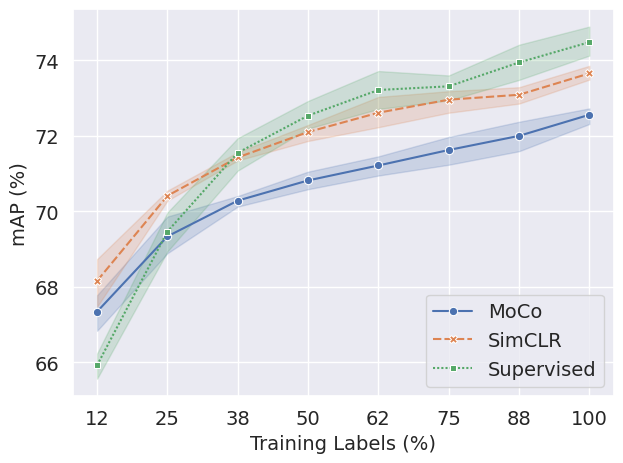
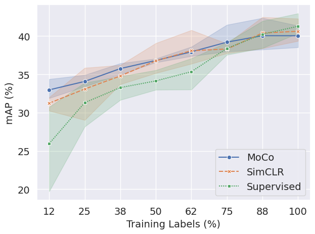

# ECG-Contrastive-Learning
In this project, we pre-train/fine-tune neural network models using SimCLR and MoCo to classify 12-lead Electrocardiography (ECG) into the diagnostic superclasses/subclasses.

Diagnostic Superclass | Diagnostic Subclass 
:------------------------:|:----------------------:
    | 

## Environment
This project was implemented and tested with Python 3.10.
One may create a conda environment using the provided `environment.yml` files:

```
conda env create -f environment.yml
```

```
conda activate ecg_clr
```

## Data

### Prepare PTB-XL ECG Dataset
Follow `0_data_preparation.ipynb` to download PTB-XL ECG dataset and pre-process them.

### Basic Data Exploration
See `1_data_exploration.ipynb`

### Data Augmentation
See `2_visualize_augmentattions.ipynb` for visualization of ECG data augmentations used in this project.

## Modeling

### Supervised Baseline
Run

```
python 3_train_supervised_baseline.py --arch <ARCHITECTURE> --label-type <LABEL_TYPE> --num-train-folds <NUM_TRAIN_FOLDS>
```
where the default values for `<ARCHITECTURE> = xresnet1d50`, `<LABEL_TYPE> = subclass`, `<NUM_TRAIN_FOLDS> = 8`.
Refer to the script for other input arguments for training configuration.

The trained model will be saved at `outputs/seed_<SEED>/supervised/<ARCHITECTURE>/<NUM_TRAIN_FOLDS>_folds/<LABEL_TYPE>` unless the `--save` argument was set when the script was run. 

### Self-supervised Contrastive Pre-training
#### SimCLR
Run

```
python 4_train_simclr.py --arch <ARCHITECTURE>
```
where the default values for `<ARCHITECTURE> = xresnet1d50`.
Refer to the script for other input arguments for training configuration.

The pre-trained model will be saved at `outputs/seed_<SEED>/simclr/<ARCHITECTURE>/pretrain` unless the `--save` argument was set when the script was run. 

#### MoCo
Run

```
python 5_train_moco.py --arch <ARCHITECTURE>
```
where the default values for `<ARCHITECTURE> = xresnet1d50`.
Refer to the script for other input arguments for training configuration.

The pre-trained model will be saved at `outputs/seed_<SEED>/moco/<ARCHITECTURE>/pretrain` unless the `--save` argument was set when the script was run. 


### Linear Evaluation / Fine-tuning Pre-trained Models
Run
```
python 6_eval_simclr.py --arch <ARCHITECTURE> --checkpoint <CHECKPOINT_PATH> --mode <MODE> --label-type <LABEL_TYPE> --num-train-folds <NUM_TRAIN_FOLDS>
```
or
```
python 6_eval_moco.py --arch <ARCHITECTURE> --checkpoint <CHECKPOINT_PATH> --mode <MODE> --label-type <LABEL_TYPE> --num-train-folds <NUM_TRAIN_FOLDS>
```
where `<ARCHITECTURE>` should be same as the one used in pre-training, e.g., `xresnet1d50`, and `<MODE>` can be either `lineval` or `finetune`.
For example,
```
python 6_eval_simclr.py --arch xresnet1d50 --checkpoint ./outputs/seed_0/simclr/xresnet1d50/pretrain/checkpoint.pth --mode lineval --label-type subclass --num-train-folds 1
```

The tuned model will be saved at `outputs/seed_<SEED>/<moco/simclr>/<ARCHITECTURE>/<MODE>/<NUM_TRAIN_FOLDS>_folds/<LABEL_TYPE>` unless the `--save` argument was set when the script was run.

### Result Analysis
See `8_results_analysis.ipynb` for the evaluation results for all models.
It is recommneded to run this notebook after training/evaluating each model with multiple seed values.
